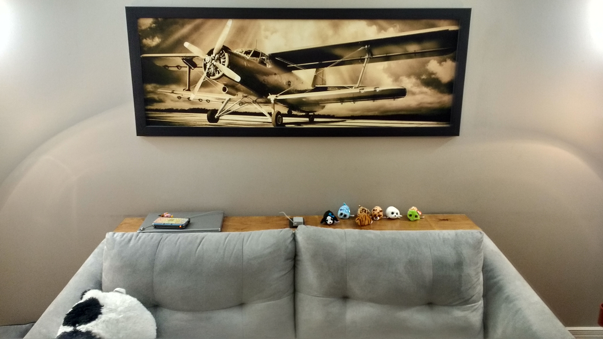
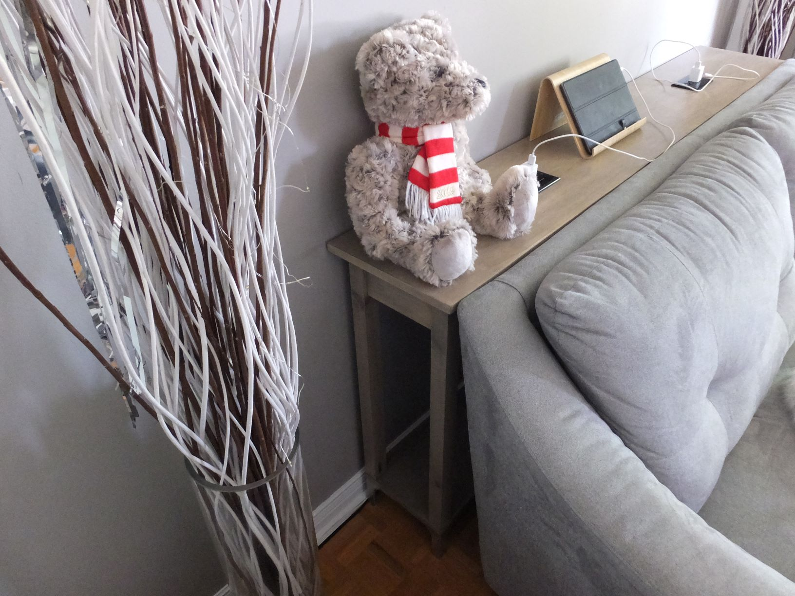

# Console
Ce projet est une console (code de projet CN1) avec des prises électriques faite sur-mesure pour aller en arrière du canapé. Il est inspiré du projet "Console Table" de [Build Something](https://www.buildsomething.com/plans/P1CFF7829247E55CF/Console-Table).

*Figure 1 - Vue de face*

*Figure 2 - Vue de côté*

Vous trouverez la liste des matériaux et de la quincaillerie nécessaires au sein de [CN1-MFG-001]. Hormi les outils de base (p. ex. ruban à mesurer), vous aurez également besoin des items suivants :

* Gabarit pour faire des trous en angle;
* Perceuse/visseuse;
* Scie circulaire pour la découpe grossière des panneaux;
* Banc de scie pour la découpe finale des panneaux;
* Scie à onglet pour découper précisement les lattes et les planches;
* Scie sauteuse pour découper les trous pour les prises électriques.

# Liste des documents
* CN1-ASY-001.pdf : dessin d'ensemble du projet avec la liste des pièces;
* CN1-MFG-001.pdf : le coût du projet;
* CN1-PRT-XYZ.pdf : le dessin de définition de la pièce numéro XYZ (notez que les pièces triviales n'ont pas de dessin de définition);
* CN1-REQ-001.pdf : le cahier des charges du projet.

# Environnement de développement
* Windows 10 comme système d'exploitation;
* QCAD Professional pour les dessins techniques;
* LibreOffice 6.* pour les documents;
* PDFtk pour manipuler les fichiers PDF;
* MinGW (mingw32-base-bin 2013072200) pour les outils de développement de base.

# Construire les artefacts
Avec l'environnement de développement correct, il vous suffit de lancer la commande "mingw32-make" depuis une invite de commande cmd.exe à la racine du projet et les documents seront générés dans le répertoire "build".

En cas d'erreurs "'X' n'est pas reconnu en tant que commande interne ou externe [...]", vérifiez que les exécutables de LibreOffice, QCAD, PDFtk et MinGW sont dans votre PATH.